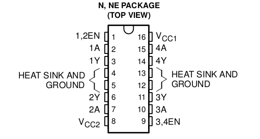

DCMotorBot
==========

DC Motor Bot is an [Arduino](http://arduino.cc/) library that allows you control bots created with 2 DC motors and H-Bridge IC like L293D.

##Features
The library supports the following operations

- Move Up
- Move Down
- Move Left
- Move Right
- Start
- Stop

## Examples
The library has an example sketch under the /examples folder which explains how to control the bot.

BasicBot.ino – Shows the normal way of using the library

## Dependency

This library does not require any other library to work.

## Setup

After downloading place the DCMotorBot folder inside your Arduino's library folder

Connect the DC motors to Arduino using H-Bridge IC like L293D. 

You can find a copy of L293D's [datasheet](datasheet/l293d.pdf) and [pin out diagram](datasheet/l293d-pinout.png) inside in the /datasheet directory

The following is the pin out diagram of the IC.

_TODO_: Add more details and schematics.

## License
The library and the example are released under released under BeerWare license.

I would, however, consider it a great courtesy if you could email me and tell me about your project and how this code was used, just for my own continued personal gratification 

You can also find other ways to [make me happy](http://sudarmuthu.com/if-you-wanna-thank-me), if you liked this project ;)

## Contribution
If you would like to contribute to this project, then just fork it in github and send a pull request.

## Support
More details about this project and the support for this project can be found at its [homepage](http://hardwarefun.com/projects/dc-motor-bot).

## TODO

- Add detailed schematics
- Add more examples
- Add speed control through PWM
- Add keywords file
